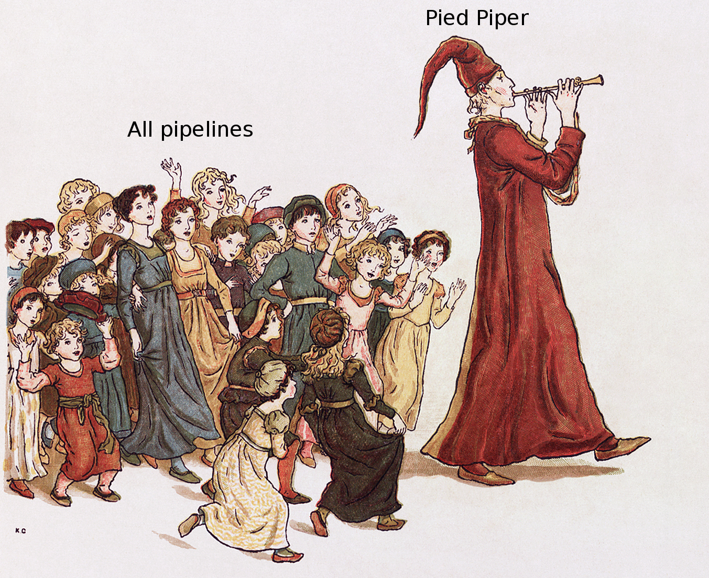

.. PiedPiper documentation master file, created by
   sphinx-quickstart on Sat Oct  8 15:34:55 2016.
   You can adapt this file completely to your liking, but it should at least
   contain the root `toctree` directive.

Welcome to Pied Piper's documentation!
======================================

   Adapted from *The Pied Piper of Hamelin* (image in public domain)

This software should not be confused with the `Pied Piper`_ platform that specializes in middle-out compression.

The Pied Piper pipeline runner is a small script tailored to be used on top of Ruffus_ for medium to large-scale
data processing on compute clusters. As such, it has been extensively used to run Ruffus pipelines via SGE_ on a
small compute cluster (32 nodes) for various Bioinformatics projects.

Contents:

.. toctree::
   :maxdepth: 1

   setup
   license

Indices and tables
==================

* :ref:`genindex`
* :ref:`modindex`
* :ref:`search`

.. _Pied Piper: http://www.piedpiper.com/
.. _Ruffus: http://ruffus.readthedocs.io/en/latest/
.. _SGE: https://en.wikipedia.org/wiki/Oracle_Grid_Engine